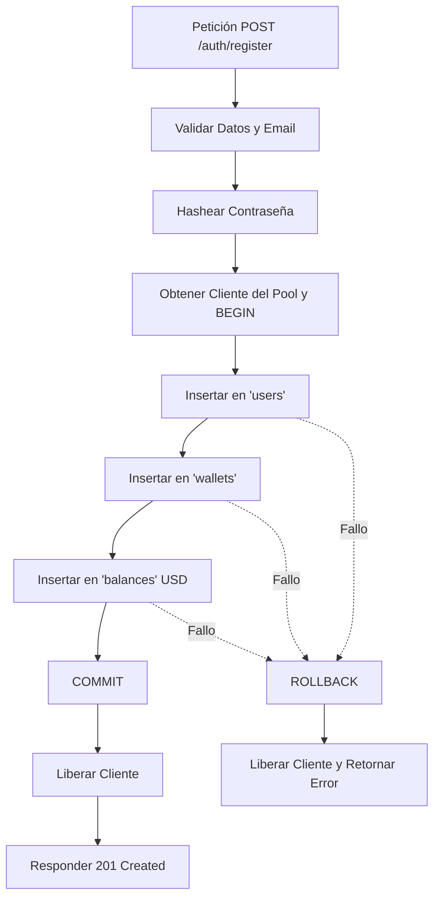

# Valora Wallet — Backend

API REST para **Valora Wallet**, billetera digital multi-moneda para freelancers y trabajadores remotos en LATAM. Permite gestionar balances en USD, EUR y ARS, ejecutar compra/venta/intercambio con tasas reales, enviar comprobantes por email y consultar un asistente financiero con IA.

## Stack

- **Runtime:** Node.js + Express + TypeScript
- **Base de datos:** PostgreSQL (Railway)
- **Autenticación:** JWT
- **Emails:** AWS SES vía Vercel Functions
- **Chatbot:** Google Gemini API (gemini-2.5-flash)
- **Testing:** Vitest
- **Despliegue:** Railway

## Requisitos

- Node.js 20+
- Cuenta de PostgreSQL local o acceso a la instancia de Railway
- Variables de entorno (ver `.env.example`)

## Instalación y setup local

```bash
git clone https://github.com/<org-o-usuario>/valora-wallet-backend.git
cd valora-wallet-backend
npm install
cp .env.example .env   # completar con tus valores locales
npm run migrate        # corre las migraciones de la base de datos
npm run dev             # levanta el servidor en modo desarrollo
```

## Variables de entorno

| Variable                | Descripción                                            |
| ----------------------- | ------------------------------------------------------ |
| `DATABASE_URL`          | Connection string de PostgreSQL                        |
| `JWT_SECRET`            | Secreto para firmar los tokens JWT                     |
| `AWS_ACCESS_KEY_ID`     | Credencial de AWS SES                                  |
| `AWS_SECRET_ACCESS_KEY` | Credencial de AWS SES                                  |
| `AWS_SES_REGION`        | Región de AWS SES                                      |
| `GEMINI_API_KEY`        | API key de Google Gemini                               |
| `FRONTEND_URL`          | URL del frontend en Vercel, usada para configurar CORS |
| `PORT`                  | Puerto local (default 3000)                            |

## Estructura del proyecto

```
src/
  ├── controllers/     # Lógica de cada endpoint
  ├── models/           # Modelos de datos (users, wallets, balances, transactions)
  ├── routes/            # Definición de rutas de la API
  ├── middlewares/     # Auth, validaciones, manejo de errores
  ├── services/           # Integraciones externas (Frankfurter, ExchangeRate-API, Gemini, AWS SES)
  └── tests/                # Suite de tests con Vitest
```

## Modelo de datos

- **users** — cuentas de usuario
- **wallets** — una wallet por usuario (relación 1:1)
- **balances** — balances por moneda dentro de cada wallet (FK a `wallet_id` + `currency_code`)
- **transactions** — ledger inmutable de todas las operaciones (compra, venta, exchange)

## API Endpoints (Módulo de Autenticación)

### Arquitectura de Transacciones Atómicas (Registro Seguro)
Para garantizar la integridad referencial y prevenir estados inconsistentes o datos huérfanos, la creación de la cuenta de usuario, su billetera y su saldo inicial en dólares (`USD`) se realiza mediante una **Transacción Atómica de PostgreSQL** utilizando un cliente dedicado del pool (`pool.connect()`).
- Si alguna de las operaciones falla (`User`, `Wallet` o `Balance`), se ejecuta un `ROLLBACK` automático para revertir cualquier inserción previa.
- Si todas las operaciones se completan de manera exitosa, se efectúa un `COMMIT` y se libera el cliente de vuelta al pool.



### Registro de Usuario
- **Ruta:** `POST /auth/register`
- **Autenticación:** Pública (Ninguna).
- **Descripción:** Registra un nuevo usuario de forma atómica en el sistema. Crea automáticamente su billetera asociada y le asigna un saldo inicial de `0.00000000 USD`.
- **Request Body (JSON):**
  ```json
  {
    "email": "usuario@ejemplo.com",
    "password": "PasswordSegura123!",
    "firstName": "Santiago",
    "lastName": "Chavez"
  }
  ```
- **Response (201 Created):**
  ```json
  {
    "token": "eyJhbGciOiJIUzI1NiIsIn...",
    "user": {
      "id": "c138d8f0-1be4-434c-b4db-01de7c7bd488",
      "email": "usuario@ejemplo.com",
      "firstName": "Santiago",
      "lastName": "Chavez"
    },
    "walletId": "f782f9d8-9db8-40a2-a60d-fb964a2f7c00"
  }
  ```

### Inicio de Sesión
- **Ruta:** `POST /auth/login`
- **Autenticación:** Pública (Ninguna).
- **Descripción:** Valida las credenciales de un usuario y retorna su información junto con un token JWT de acceso.
- **Request Body (JSON):**
  ```json
  {
    "email": "usuario@ejemplo.com",
    "password": "PasswordSegura123!"
  }
  ```
- **Response (200 OK):**
  ```json
  {
    "token": "eyJhbGciOiJIUzI1NiIsIn...",
    "user": {
      "id": "c138d8f0-1be4-434c-b4db-01de7c7bd488",
      "email": "usuario@ejemplo.com",
      "firstName": "Santiago",
      "lastName": "Chavez"
    },
    "walletId": "f782f9d8-9db8-40a2-a60d-fb964a2f7c00"
  }
  ```

### Perfil del Usuario Autenticado
- **Ruta:** `GET /auth/me`
- **Autenticación:** Requerida (`Authorization: Bearer <token>`).
- **Descripción:** Obtiene los datos del perfil, la billetera y los saldos del usuario actualmente autenticado mediante el token JWT.
- **Response (200 OK):**
  ```json
  {
    "user": {
      "id": "c138d8f0-1be4-434c-b4db-01de7c7bd488",
      "email": "usuario@ejemplo.com",
      "firstName": "Santiago",
      "lastName": "Chavez"
    },
    "walletId": "f782f9d8-9db8-40a2-a60d-fb964a2f7c00",
    "balances": [
      {
        "id": "...",
        "wallet_id": "...",
        "currency_code": "USD",
        "amount": "100.00000000",
        "created_at": "...",
        "updated_at": "..."
      }
    ]
  }
  ```

## Ejecución de Pruebas

Para ejecutar la suite completa de pruebas (modelos de datos y sistema de autenticación) con Vitest y Supertest, ejecuta el siguiente comando:

```bash
npm run test
```

## Scripts disponibles

```bash
npm run dev        # desarrollo con hot-reload
npm run build      # build de producción
npm run start      # levanta el build de producción
npm run test        # corre la suite de Vitest
npm run migrate    # corre migraciones de base de datos
```

## Despliegue

Conectado a Railway: cada push a `main` dispara un deploy automático. Las variables de entorno se configuran en el dashboard de Railway, nunca se commitean.

## Known issues

_(agregar acá cualquier decisión técnica relevante, como la de mantener versiones de dependencias por temas de compatibilidad)_

## Equipo

- Santiago Chavez — Backend Core (modelo de datos, autenticación, despliegue, testing)
- Daniel Sardinas — Lógica de negocio + IA (compra/venta/intercambio, tasas de cambio, chatbot Gemini)
- Gerardo Acosta — Frontend Lead (colaborador en este repo)
- Analía Pérez Juliá — Integración AWS SES, documentación, coordinación y tareas de Frontend.
