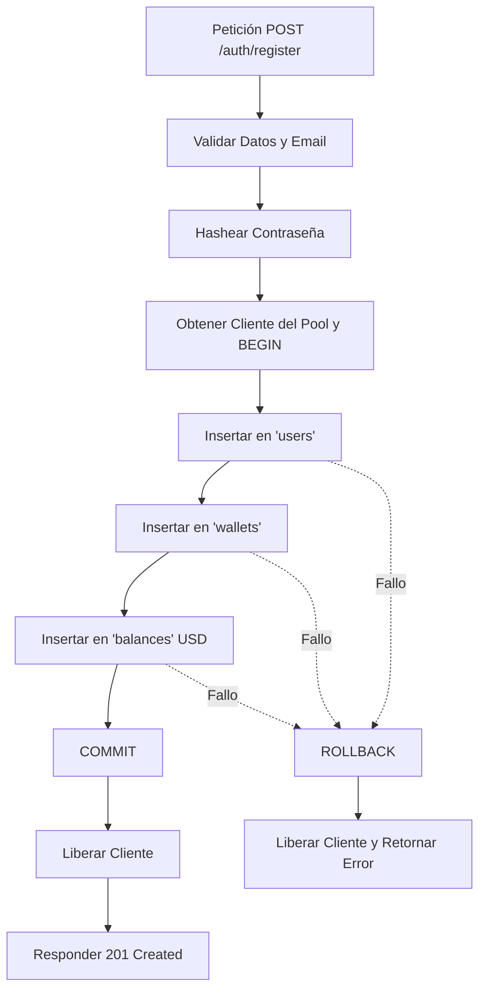

# Valora Wallet — Backend

API REST para **Valora Wallet**, billetera digital multi-moneda para freelancers y trabajadores remotos en LATAM. 

Desarrollado originalmente por **Nexo Tech Solutions** como Proyecto Final para la carrera Full Stack de **Henry**, y actualmente mantenido y evolucionado de manera **personal e individual por Santiago Chavez**.

> ℹ️ **Nota de Evolución del Proyecto:**  
> La versión original del proyecto utilizaba infraestructura de pago (Railway para Backend/DB y AWS SES para emails). La presente versión fue optimizada, refactorizada y migrada para operar íntegramente sobre **planes gratuitos** bajo cuentas personales de Santiago Chavez:
> - **Frontend:** Desplegado en **Vercel**.
> - **Backend API:** Desplegado en **Render**.
> - **Base de Datos:** **Neon PostgreSQL (Serverless)**.
> - **Servicio de Emails:** Migrado a **Nodemailer + Gmail SMTP** (reemplazando AWS SES).
> - **Asistente de IA (Chatbot):** Integrado con **Google Gemini 3.5 Flash Lite** para respuestas financieras inteligentes y alto límite de contexto.

> **Nuestra Misión:** Facilitar la vida financiera de los profesionales independientes permitiéndoles centralizar cobros internacionales en múltiples monedas, realizar conversiones con tasas transparentes en tiempo real y contar con un asistente de IA para optimizar la gestión de sus ingresos.

## 🚀 Enlaces de Despliegue

- **Frontend (Vercel):** [https://valora-wallet-frontend-chi.vercel.app](https://valora-wallet-frontend-chi.vercel.app) *(¡Probá la aplicación en vivo desde acá!)*
- **Backend API (Render):** [https://valora-wallet-backend.onrender.com](https://valora-wallet-backend.onrender.com)
- **Base de Datos PostgreSQL (Neon):** PostgreSQL serverless activo y conectado.

---

## 🔑 Cuentas de Prueba (Demo Users)

Para probar todas las funcionalidades en vivo o localmente sin necesidad de registrarse desde cero, puedes iniciar sesión con cualquiera de las siguientes cuentas demo precargadas:

> **Contraseña universal para todas las cuentas demo:** `Test1234!`

| Usuario | Correo Electrónico | País | Alias Valora | Saldos Precargados |
| :--- | :--- | :---: | :--- | :--- |
| **Juan Pérez** | `demo.juan@valora.com` | 🇦🇷 AR | `demo.juan.valora` | $3,900 USD · $150,000 ARS · €1,000 EUR |
| **María Gómez** | `demo.maria@valora.com` | 🇨🇴 CO | `demo.maria.valora` | $3,900 USD · $150,000 ARS · €1,000 EUR |
| **Carlos López** | `demo.carlos@valora.com` | 🇲🇽 MX | `demo.carlos.valora` | $3,900 USD · $150,000 ARS · €1,000 EUR |

*(También puedes registrar una cuenta nueva o ingresar con tu cuenta de Google).*

---

## Stack

- **Runtime:** Node.js 22+ / Express 5 / TypeScript (ESM)
- **Base de datos:** PostgreSQL (Neon)
- **Autenticación:** JWT (HS256, TTL 15 min) + Google OAuth 2.0
- **Validación:** Zod v4 + libphonenumber-js (celular por país) + validación de DU por país
- **Emails:** Nodemailer + Gmail SMTP (comprobantes transaccionales y recuperación de cuenta)
- **Chatbot:** Google Gemini API (gemini-3.5-flash-lite)
- **Seguridad:** express-rate-limit, CORS whitelist dinámica, middleware de perfil completo
- **Testing:** Vitest + Supertest (20 suites, 130+ tests)
- **Despliegue:** Render (Backend) / Vercel (Frontend)

## Requisitos

- Node.js 22+
- Cuenta de PostgreSQL local o acceso a la instancia de Neon
- Variables de entorno (ver `.env.example`)
- (Opcional) Google Cloud Console con OAuth Client ID configurado para login con Google
- Cuenta de Gmail con Contraseña de Aplicación (App Password) habilitada

## Instalación y setup local

```bash
git clone https://github.com/nexotsolutions-creator/valora-wallet-backend.git
cd valora-wallet-backend
npm install
cp .env.example .env   # completar con tus valores locales
npm run db:init        # inicializa el esquema de la base de datos (PostgreSQL)
npm run db:seed        # (opcional) poblar con datos demo para la presentación
npm run dev             # levanta el servidor en modo desarrollo
```

## Variables de entorno

| Variable                | Descripción                                            |
| ----------------------- | ------------------------------------------------------ |
| `DATABASE_URL`          | Connection string de PostgreSQL                        |
| `DB_SSL_REJECT_UNAUTHORIZED` | Valida estrictamente certificados SSL de la base de datos (por defecto `true`). Colocar `false` para omitir. |
| `JWT_SECRET`            | Secreto para firmar los tokens JWT (HS256, TTL 15 min) |
| `GOOGLE_CLIENT_ID`      | Client ID de Google OAuth 2.0 (Google Cloud Console)   |
| `EMAIL_USER`            | Dirección de correo de Gmail para el envío de notificaciones y comprobantes |
| `EMAIL_PASS`            | Contraseña de aplicación (App Password) de 16 caracteres de Google |
| `GEMINI_API_KEY`        | API key de Google Gemini                               |
| `FRONTEND_URL`          | URL del frontend en Vercel, usada para configurar CORS |
| `PORT`                  | Puerto local (default 3000)                            |

## Estructura del proyecto

```
src/
  ├── controllers/     # Lógica de cada endpoint (auth, transactions, balances, chatbot, catalog)
  ├── database/        # Schema SQL, deploy script y seed data para demo
  ├── middlewares/     # Auth JWT, validación Zod, rate limiting, perfil completo, CORS, errores
  ├── models/          # Modelos de datos (users, wallets, balances, transactions)
  ├── routes/          # Definición de rutas de la API
  ├── schemas/         # Esquemas de validación Zod (auth, transactions)
  ├── services/        # Integraciones externas (Frankfurter, Gemini, Nodemailer/Gmail SMTP)
  ├── tests/           # 18 suites de tests con Vitest + Supertest
  └── utils/           # JWT, validación de celular, validación de documento
docs/
  ├── CHANGELOG.md     # Historial de versiones
  ├── Endpoints.txt    # Guía completa de endpoints para Insomnia/REST Client
  ├── Explicacion.md   # Detalle técnico del motor financiero
  └── informe_frontend.md  # Reporte de integración Backend → Frontend
```

---

## 🤝 Metodología de Trabajo y Reglas de Contribución

Trabajamos bajo un marco **Ágil** en Sprints semanales (Sprint 1: Fundamentos, Sprint 2: Funcionalidad core). Usamos tableros Kanban (Trello/Ora) y aplicamos la regla **INVEST** para dividir las historias de usuario en tareas pequeñas y manejables antes de tirar la primera línea de código.

### Flujo de Git (Feature Branches + PRs)
1. **Ramas Protegidas:** `main` (Producción estable, rama "épica") y `dev` (Integración).
2. **Ramas Personales:** Cada integrante desarrolla sus tareas en su rama personal (ej. `feat/santiago_db`).
3. **Pull Requests (PRs):** 
   - Se abren hacia la rama `dev`.
   - Deben ser atómicos ("Do one thing and do it well").
   - Si un PR está en progreso y sirve para conversar, se titula con `WIP: `.
   - **Code Review Obligatorio:** Todo PR requiere al menos 1 aprobación cruzada. Fomenta la visión holística del proyecto y evita que "reinventemos la rueda". El autor del PR es responsable de mergearlo una vez aprobado.

### Convenciones de Código (Clean Code)
- **Idioma Híbrido:** Todo el código fuente (variables, funciones, esquemas) se escribe estrictamente en **Inglés** por estándar de la industria. Sin embargo, los **comentarios y los mensajes de los commits se escriben en Español** para agilizar la comunicación interna del equipo.
- **Nombramiento (El nombre justo):** 
  - Variables/Funciones: `camelCase` (ej. `getUserTransactions`). Priorizamos nombres explícitos que eviten la necesidad de comentarios.
  - Constantes ("No hardcodeo"): `UPPER_SNAKE_CASE` (ej. `PASSWORD_RESET_TOKEN_TTL_MS`).
- **Commits:** Pequeños y específicos. Usamos **Conventional Commits** adaptado al español:
  - Formato: `tipo(área): descripción clara`
  - Ejemplos: `feat(auth): implementar límite de tasa por IP`, `fix(db): corregir desbordamiento numérico`.

## 📊 Modelo de Datos y Justificación de Diseño (PostgreSQL)

El diseño de la base de datos sigue las mejores prácticas de modelado relacional para garantizar consistencia, integridad de los datos y alto rendimiento. Las tablas principales del esquema son:

- **`users`** — Almacena las cuentas de los usuarios (datos personales, email y contraseña hasheada).
- **`wallets`** — Representa la billetera digital vinculada al usuario (relación 1:1).
- **`balances`** — Registra los saldos disponibles por moneda para cada billetera (relación 1:N).
- **`transactions`** — Funciona como un ledger (libro contable) inmutable de todas las operaciones (compras, ventas, exchanges, depósitos, transferencias).
- **`cards`** — Administra las tarjetas virtuales y físicas asociadas a la billetera (relación 1:N) con control de congelamiento y generación segura (algoritmo de Luhn).
- **`chatbot_histories`** — Registra el historial de conversaciones del asistente financiero por usuario.

### Justificación de las Decisiones de Diseño (Criterio de Rúbrica)

Para cumplir con los más altos estándares de calidad y auditoría, se tomaron las siguientes decisiones de ingeniería y diseño:

* **Separación de Responsabilidades (Relación 1:1 entre `users` y `wallets`):**
  Se desacopló la entidad de identidad del usuario (`users`) de su billetera financiera (`wallets`). Esto encapsula la lógica de negocio, facilita el mantenimiento de seguridad independiente (por ejemplo, auditoría de accesos) y deja abierta la arquitectura para escenarios futuros como múltiples billeteras por usuario.
* **Normalización Multi-moneda Dinámica (Relación 1:N entre `wallets` y `balances`):**
  En lugar de almacenar los saldos como columnas estáticas en la tabla `wallets` (ej. `balance_usd`, `balance_ars`), se diseñó una tabla independiente `balances` vinculada por clave foránea (`wallet_id`). Esto permite dar soporte a nuevas monedas de manera dinámica sin necesidad de alterar la estructura física (DDL) de la base de datos.
* **Consistencia y Seguridad con Clave Única Compuesta (`UNIQUE`):**
  Se definió una restricción única compuesta en la tabla `balances` utilizando la tupla `(wallet_id, currency_code)`. Esto garantiza a nivel físico y lógico que nunca existan saldos duplicados de una misma moneda para una billetera, manteniendo la consistencia de los balances.
* **Precisión Financiera Exacta (`NUMERIC(18,8)`):**
  Los montos en las tablas `balances` y `transactions` se definen utilizando el tipo de dato `NUMERIC(18,8)` en lugar de tipos de coma flotante (`FLOAT` o `REAL`). Los floats presentan imprecisiones inherentes por redondeo binario de la norma IEEE 754, inviables en aplicaciones fintech. El tipo `NUMERIC` garantiza precisión contable exacta hasta el octavo decimal (adecuado tanto para monedas tradicionales como para criptoactivos).
* **Garantía Anti-Sobregiros a Nivel Motor (`CHECK constraint`):**
  Se incorporó la restricción `CHECK (amount >= 0)` en la tabla `balances`. De esta manera, el propio motor de base de datos rechaza cualquier operación que intente restar un monto superior al saldo actual, blindando al sistema contra giros en descubierto de forma nativa.
* **Libro de Transacciones Inmutable (`transactions`):**
  La tabla `transactions` registra de forma histórica e inalterable todas las operaciones financieras. No permite actualizaciones (`UPDATE`) ni borrados, garantizando que el historial de transacciones sirva como una pista de auditoría confiable. Almacena las tasas de cambio históricas y el saldo resultante (`resulting_balance`) para evitar recálculos costosos y facilitar la conciliación de saldos.
* **Optimización de Consultas mediante Índices Apropiados:**
  Se implementó un índice no agrupado en `transactions(wallet_id)` (`idx_transactions_wallet_id`). La consulta más frecuente e importante a nivel de negocio en esta tabla es el filtrado del historial de transacciones de una billetera. El índice evita escaneos secuenciales completos de la tabla, manteniendo las búsquedas en tiempo constante $O(1)$ o logarítmico $O(\log N)$ a medida que crece el ledger.
* **Integridad Referencial con Eliminación en Cascada (`ON DELETE CASCADE`):**
  Las claves foráneas de `wallets`, `balances` y `transactions` include la directiva `ON DELETE CASCADE` hacia sus respectivas dependencias jerárquicas superiores. Esto asegura que si se elimina un usuario, se purguen automáticamente todas sus entidades asociadas, previniendo la existencia de registros huérfanos en cumplimiento con los estándares de diseño relacional.

## API Endpoints (Módulo de Autenticación)

### Arquitectura de Transacciones Atómicas (Registro Seguro)
Para garantizar la integridad referencial y prevenir estados inconsistentes o datos huérfanos, la creación de la cuenta de usuario, su billetera y su saldo inicial en dólares (`USD`) se realiza mediante una **Transacción Atómica de PostgreSQL** utilizando un cliente dedicado del pool (`pool.connect()`).
- Si alguna de las operaciones falla (`User`, `Wallet` o `Balance`), se ejecuta un `ROLLBACK` automático para revertir cualquier inserción previa.
- Si todas las operaciones se completan de manera exitosa, se efectúa un `COMMIT` y se libera el cliente de vuelta al pool.



### Registro de Usuario
- **Ruta:** `POST /auth/register`
- **Autenticación:** Pública (Ninguna).
- **Descripción:** Registra un nuevo usuario de forma atómica en el sistema. Crea automáticamente su billetera asociada y le asigna un saldo inicial de `0.00000000 USD`.
- **Request Body (JSON):**
  ```json
  {
    "email": "usuario@ejemplo.com",
    "password": "PasswordSegura123!",
    "firstName": "Santiago",
    "lastName": "Chavez"
  }
  ```
- **Response (201 Created):**
  ```json
  {
    "token": "eyJhbGciOiJIUzI1NiIsIn...",
    "user": {
      "id": "c138d8f0-1be4-434c-b4db-01de7c7bd488",
      "email": "usuario@ejemplo.com",
      "firstName": "Santiago",
      "lastName": "Chavez"
    },
    "walletId": "f782f9d8-9db8-40a2-a60d-fb964a2f7c00"
  }
  ```

### Inicio de Sesión
- **Ruta:** `POST /auth/login`
- **Autenticación:** Pública (Ninguna).
- **Descripción:** Valida las credenciales de un usuario y retorna su información junto con un token JWT de acceso.
- **Request Body (JSON):**
  ```json
  {
    "email": "usuario@ejemplo.com",
    "password": "PasswordSegura123!"
  }
  ```
- **Response (200 OK):**
  ```json
  {
    "token": "eyJhbGciOiJIUzI1NiIsIn...",
    "user": {
      "id": "c138d8f0-1be4-434c-b4db-01de7c7bd488",
      "email": "usuario@ejemplo.com",
      "firstName": "Santiago",
      "lastName": "Chavez"
    },
    "walletId": "f782f9d8-9db8-40a2-a60d-fb964a2f7c00"
  }
  ```

### Perfil del Usuario Autenticado
- **Ruta:** `GET /auth/me`
- **Autenticación:** Requerida (`Authorization: Bearer <token>`).
- **Descripción:** Obtiene los datos del perfil, la billetera y los saldos del usuario actualmente autenticado mediante el token JWT.
- **Response (200 OK):**
  ```json
  {
    "user": {
      "id": "c138d8f0-1be4-434c-b4db-01de7c7bd488",
      "email": "usuario@ejemplo.com",
      "firstName": "Santiago",
      "lastName": "Chavez"
    },
    "walletId": "f782f9d8-9db8-40a2-a60d-fb964a2f7c00",
    "balances": [
      {
        "id": "...",
        "wallet_id": "...",
        "currency_code": "USD",
        "amount": "100.00000000",
        "created_at": "...",
        "updated_at": "..."
      }
    ]
  }
  ```

### Cierre de Sesión (Logout)
* **Mecanismo:** Descentralizado / Stateless.
* **Descripción:** Al utilizar autenticación basada en tokens JWT sin estado (stateless), el servidor no mantiene sesiones persistentes en memoria o base de datos. El cierre de sesión se gestiona íntegramente en el cliente (frontend) mediante las siguientes acciones:
  1. Eliminar el token JWT almacenado localmente (ej. `localStorage.removeItem('token')` o borrar las cookies asociadas).
  2. Limpiar el estado de autenticación en el gestor de estado global (Redux, Context API, etc.).
  3. Redirigir al usuario a la pantalla de Login.
  Esto garantiza que cualquier petición subsiguiente no incluya la cabecera `Authorization: Bearer <token>`, denegando automáticamente el acceso al usuario y liberando memoria en el servidor.

### Protección de Rutas (Middleware)
Todas las rutas que requieran autenticación pasan a través del middleware `authMiddleware.ts`. Este middleware realiza las siguientes validaciones:
1. **Presencia del Token:** Verifica que exista la cabecera `Authorization`.
2. **Formato:** Valida que el formato del header corresponda a `Bearer <token>`.
3. **Firma y Algoritmo:** Valida la firma del token con el `JWT_SECRET` utilizando el algoritmo explícito `HS256` para evitar ataques de manipulación de algoritmos (JWT algorithm confusion).
4. **Vigencia:** Valida que el token no haya expirado.
5. **Inyección de Contexto:** Si el token es válido, decodifica el payload (que contiene `userId` y `email`) e inyecta la información en el objeto `req.user`, extendiendo la interfaz `Request` de Express para que los controladores subsiguientes tengan acceso a la identidad del usuario de manera segura.

## Ejecución de Pruebas

Para ejecutar la suite completa de pruebas (modelos de datos y sistema de autenticación) con Vitest y Supertest, ejecuta el siguiente comando:

```bash
npm run test
```

## Scripts disponibles

```bash
npm run dev        # desarrollo con hot-reload
npm run build      # build de producción
npm run start      # levanta el build de producción
npm run test       # corre las 18 suites de Vitest (100+ tests)
npm run db:init    # inicializa y despliega el esquema SQL en la base de datos (PostgreSQL)
npx tsx src/database/seed.ts  # poblar con usuarios demo y transacciones para la presentación
```

## ⚙️ Despliegue en Producción (Render, Neon y Vercel)

El backend de **Valora Wallet** se encuentra configurado para un flujo de Integración y Despliegue Continuo (CI/CD) conectado a **Render** y **Neon**:

1. **Conexión Automática:** Cada push a la rama `main` del repositorio de GitHub dispara un deploy automático en **Render**.
2. **Infraestructura de Base de Datos:** Se utiliza una instancia serverless de **PostgreSQL en Neon**, la cual mantiene la persistencia y alta disponibilidad de los datos.
3. **Configuración de Entorno:** Las variables de entorno críticas (definidas en `.env.example`) se configuran directamente en el panel de control del servicio de Render, asegurando que ningún dato sensible o credencial de API se exponga en el repositorio.
4. **CORS:** El backend restringe el acceso de orígenes cruzados permitiendo únicamente peticiones provenientes de la URL del frontend desplegado en **Vercel** (configurado a través de `FRONTEND_URL`) y del entorno de desarrollo local.

## Seed Data (Datos de Demostración)

Para poblar la base de datos con usuarios, saldos y transacciones de prueba para la demo:

```bash
npx tsx src/database/seed.ts
```

Esto crea 3 usuarios demo (`demo.juan@valora.com`, `demo.maria@valora.com`, `demo.carlos@valora.com`) con:
- Saldos pre-cargados: $3,900 USD, $150,000 ARS y €1,000 EUR cada uno.
- Historial de transacciones variado (depósito, compra de divisas, intercambio).

El script es idempotente (seguro de re-ejecutar) y corre dentro de una transacción ACID.

## Documentación Completa de Endpoints

La guía paso a paso para probar todos los endpoints con Insomnia o cualquier cliente HTTP se encuentra en [`docs/Endpoints.txt`](docs/Endpoints.txt).

## 👥 El Equipo (Nexo Tech Solutions & Desarrollo Personal)

El proyecto nació bajo la coordinación del equipo **Nexo Tech Solutions** para el Proyecto Final de Henry:

- **Santiago Ezequiel Chavez:** Full Stack (Backend Core Lead & Actual Maintainer). Arquitectura PostgreSQL ACID, seguridad de API, validaciones Zod, testing, despliegue en Render/Neon y evolución personal del proyecto.
- **Daniel Sardinas:** Full Stack (AI & Core Logic). Integración inicial de Gemini y lógica de transacciones complejas.
- **Gerardo Acosta:** Full Stack (Orientación Frontend). Routing, layout, vistas principales e historial.
- **Analía Pérez Juliá:** Full Stack (Orientación Frontend + Integraciones). UX/UI, maquetado, validaciones multi-país y Scrum Master.