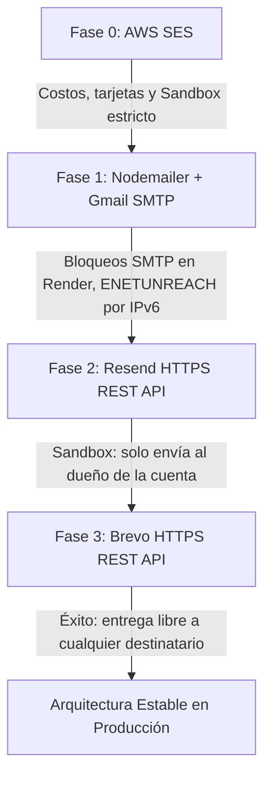

# Bitácora de Ingeniería: La Odisea del Servicio de Emails Transaccionales
> **Caso de Estudio:** Migración y Resiliencia en Arquitectura Cloud Gratuita (AWS SES ➔ Nodemailer/Gmail ➔ Resend ➔ Brevo).

Este documento registra los desafíos técnicos, problemas en entornos de nube (Render, Vercel, Neon), diagnósticos y soluciones definitivas aplicadas al subsistema de correos electrónicos transaccionales de **Valora Wallet**. Su propósito es servir de guía práctica y lección aprendida para desarrolladores que enfrenten problemáticas similares al desplegar servicios fintech sobre infraestructura gratuita o serverless.

---

## 🧭 1. El Objetivo de Arquitectura

El proyecto original de Valora Wallet nació con servicios pagos empresariales. Al finalizar la etapa académica y pasar a ser mantenido individualmente como proyecto de portfolio por **Santiago Chavez**, se fijó una premisa clara:
* **Operar 100% sobre planes gratuitos y confiables**, sin comprometer la seguridad, la entrega de notificaciones críticas (comprobantes de transferencias, depósitos y recuperación de contraseña) ni la experiencia de usuario.

---

## 🔍 2. Cronología de la Evolución, Fallos y Soluciones



---

### Fase 0: AWS SES (Amazon Simple Email Service)

* **Implementación:** `@aws-sdk/client-ses` con credenciales IAM (`AWS_ACCESS_KEY_ID`, `AWS_SECRET_ACCESS_KEY`, `AWS_SES_REGION`).
* **El Problema:**
  1. **Riesgo Financiero:** Requiere asociar una tarjeta de crédito activa con riesgo de cobros incidentales o facturaciones imprevistas por tráfico no controlado.
  2. **Régimen Sandbox Inviable:** En cuentas nuevas de AWS, SES inicia en modo "Sandbox", lo que significa que **únicamente permite enviar correos a direcciones de email previamente verificadas una a una en la consola de AWS**. Si un usuario se registraba con su correo real, AWS rebotaba el envío inmediatamente. Salir del sandbox requiere abrir un ticket de soporte empresarial y esperar días para aprobación humana.
* **Veredicto:** ❌ Descartado en favor de soluciones gratuitas y sin riesgo de cobro.

---

### Fase 1: Nodemailer + Gmail SMTP

* **Implementación:** Transporte SMTP tradicional con `nodemailer` apuntando a `smtp.gmail.com` (puerto 587) mediante una *App Password* (Contraseña de Aplicación) de Google.
* **Los Problemas en Producción (Render Free Tier):**
  1. **Políticas Anti-Abuso de Google:** Las cuentas personales de Gmail tienen límites diarios estrictos (~500 correos) y sus filtros heurísticos marcan como actividad sospechosa el envío automatizado de correos transaccionales desde servidores en la nube, con riesgo de baneo permanente de la cuenta de Google personal.
  2. **Latencia y Bloqueo de Puertos SMTP:** Muchos proveedores de nube gratuitos (como Render) aplican filtros o estrangulamiento de paquetes en puertos SMTP salientes (25, 465, 587) para prevenir que instancias comprometidas envíen SPAM.
  3. **El Error Crítico de Red (`ENETUNREACH` por IPv6):**
     * En Node.js v18+, el orden de resolución DNS por defecto es `verbatim` (favorece registros IPv6 `AAAA`).
     * Cuando Nodemailer resolvía el host `smtp.gmail.com`, obtenía una dirección IPv6. Como la infraestructura de red de contenedores de Render no tiene conectividad IPv6 saliente completa, el intento de conexión TCP se congelaba y crasheaba con:
       ```text
       Error: connect ENETUNREACH 2607:f8b0:4005:809::200d:587
       ```
* **Soluciones Parciales Aplicadas:**
  * Se forzó el orden de resolución DNS en [server.ts](file:///c:/Users/Santiago/Proyectos%20integradores/Proyecto%20Final/Valora-wallet/valora-wallet-backend/src/server.ts):
    ```typescript
    import dns from "node:dns";
    dns.setDefaultResultOrder("ipv4first");
    ```
  * Se activó *connection pooling* en Nodemailer para reutilizar sockets TCP.
* **Veredicto:** ⚠️ Aunque funcionaba tras el fix de DNS, depender de SMTP clásico y de una cuenta personal de Google seguía siendo frágil para producción.

---

### Fase 2: Resend HTTPS REST API

* **Implementación:** Librería oficial `resend` comunicándose vía HTTPS (puerto 443) mediante API Key (`re_...`).
* **Por qué se eligió:** La API REST sobre HTTPS resuelve de raíz todos los problemas de firewalls SMTP y conexiones de socket colgadas, ya que el puerto 443 siempre está abierto y rutea sin problemas en cualquier nube.
* **El Problema Oculto (El Muro del Sandbox en Plan Gratuito):**
  * Resend ofrece un remitente predeterminado: `onboarding@resend.dev`.
  * **La Restricción:** Sin un dominio corporativo propio verificado con registros DNS (SPF, DKIM, DMARC), el plan gratuito de Resend **únicamente autoriza enviar correos a la misma dirección de email con la que se creó la cuenta de Resend**.
  * **Consecuencia:** En pruebas locales funcionaba al enviar correos a la propia cuenta del desarrollador. Pero en producción, cuando un usuario real (`demo.maria@valora.com` o el email de un evaluador) realizaba un registro o una transferencia, la API de Resend respondía con error `403 Forbidden`:
    ```text
    [Background Notification Error] Error: You can only send testing emails to your own email address (ch***@gmail.com). To send to other domains, add a custom domain.
    ```
* **Veredicto:** ❌ Inviable para una billetera interactiva donde usuarios con diferentes correos deben recibir sus comprobantes y notificaciones de forma autónoma.

---

### Fase 3: Brevo (Sendinblue) HTTPS REST API — Solución Definitiva

* **Por qué Brevo:**
  1. **Plan Gratuito Generoso:** 300 correos diarios sin costo, ideal para entornos de portfolio, demos y proyectos medianos.
  2. **Envío Libre sin Restricción de Sandbox:** Permite enviar correos a **cualquier destinatario del mundo** utilizando una cuenta de Gmail gratuita verificada como remitente. No te obliga a adquirir un dominio web de pago para hacer funcionar las notificaciones.
  3. **Comunicación HTTPS (Puerto 443):** No utiliza protocolos SMTP propensos a bloqueos, sino la API REST v3 (`https://api.brevo.com/v3/smtp/email`).
  4. **Zero Dependencies:** Implementado con el cliente nativo `fetch` de Node.js, eliminando paquetes pesados de terceros y acelerando el build.

#### ⚠️ Obstáculo durante la Integración: Clave SMTP vs Clave API REST
Al configurar la cuenta de Brevo, el panel ofrece dos tipos de credenciales que se confunden fácilmente:
* **Claves SMTP (`xsmtpsib-...`):** Son contraseñas destinadas al servidor de relé `smtp-relay.brevo.com:587`.
* **Claves API REST (`xkeysib-...`):** Son tokens de autorización para los endpoints HTTP (`https://api.brevo.com/v3/...`).

Al utilizar inicialmente la clave `xsmtpsib-...` en las cabeceras HTTP `api-key`, Brevo respondía:
```json
401 { "message": "Key not found", "code": "unauthorized" }
```
**Solución:** Ingresar en Brevo a **SMTP & API ➔ Pestaña "Claves API y MCP"**, generar la clave que inicia con el prefijo **`xkeysib-`**, y configurarla en la variable `BREVO_API_KEY`.

---

## 📊 3. Tabla Comparativa de Proveedores

| Criterio | AWS SES | Gmail SMTP (Nodemailer) | Resend (Free) | Brevo HTTPS API |
| :--- | :---: | :---: | :---: | :---: |
| **Costo** | Pago por uso (Tarjeta requerida) | Gratuito | Gratuito | Gratuito (300/día) |
| **Protocolo** | AWS SDK / HTTPS | SMTP (587 / 465) | HTTPS REST API (443) | HTTPS REST API (443) |
| **Bloqueo en Render Cloud** | Ninguno | Alto (ENETUNREACH / Puertos cerrados) | Ninguno | Ninguno |
| **Sandbox de Destinatarios** | ❌ Requiere verificar cada receptor | ✅ Abierto a cualquiera | ❌ Solo envía a tu propio email | ✅ **Abierto a cualquiera** |
| **Exigencia de Dominio Propio** | Opcional pero recomendada | No | **Obligatorio para salir de sandbox** | **No requerida (acepta Gmail verificado)** |
| **Dependencias del Proyecto** | `@aws-sdk/client-ses` | `nodemailer` | `resend` | **Ninguna (`fetch` nativo)** |
| **Veredicto Final** | Inviable (costos/tarjeta) | Frágil en la nube | Inviable para usuarios externos | 🏆 **Ganador para Producción** |

---

## 🛠️ 4. Código de la Solución Final ([emailService.ts](file:///c:/Users/Santiago/Proyectos%20integradores/Proyecto%20Final/Valora-wallet/valora-wallet-backend/src/services/emailService.ts))

```typescript
import { emailRegex } from "../utils/emailValidation.js";

function redactEmail(email: string): string {
  const atIndex = email.indexOf("@");
  return atIndex === -1 ? "***" : `***${email.slice(atIndex)}`;
}

export interface EmailConfirmacionParams {
  destinatario: string;
  asunto: string;
  cuerpoHtml: string;
}

export async function enviarEmailConfirmacion({
  destinatario,
  asunto,
  cuerpoHtml,
}: EmailConfirmacionParams): Promise<string> {
  const destinatarioNormalizado = destinatario.trim();

  if (!emailRegex.test(destinatarioNormalizado)) {
    throw new Error("El email del destinatario provisto no tiene un formato válido.");
  }
  if (!asunto.trim()) throw new Error("El asunto del email no puede estar vacío.");
  if (!cuerpoHtml.trim()) throw new Error("El cuerpo del email no puede estar vacío.");

  const apiKey = process.env.BREVO_API_KEY?.trim();
  if (!apiKey) {
    throw new Error("La variable de entorno BREVO_API_KEY no está configurada.");
  }

  const senderEmail = process.env.BREVO_SENDER_EMAIL?.trim() || "chavezsantiago480@gmail.com";
  const senderName = process.env.BREVO_SENDER_NAME?.trim() || "Valora Wallet";

  try {
    const response = await fetch("https://api.brevo.com/v3/smtp/email", {
      method: "POST",
      headers: {
        accept: "application/json",
        "api-key": apiKey,
        "content-type": "application/json",
      },
      body: JSON.stringify({
        sender: { name: senderName, email: senderEmail },
        to: [{ email: destinatarioNormalizado }],
        subject: asunto,
        htmlContent: cuerpoHtml,
      }),
    });

    const data = (await response.json().catch(() => ({}))) as {
      messageId?: string;
      message?: string;
      code?: string;
    };

    if (!response.ok) {
      throw new Error(data.message || `Error de Brevo API (${response.status})`);
    }

    return data.messageId || "sent";
  } catch (error) {
    console.error("Fallo al enviar email de confirmación vía Brevo", {
      destinatario: redactEmail(destinatarioNormalizado),
      error: error instanceof Error ? { name: error.name, message: error.message } : error,
    });
    throw error;
  }
}
```

---

## 💡 5. Lecciones Clave para la Comunidad

1. **Evitá SMTP en Contenedores Gratuitos de Nube:** Siempre que puedas, utilizá **APIs REST sobre HTTPS (puerto 443)**. Los puertos SMTP estándar son el blanco principal de políticas restrictivas de firewall en la nube.
2. **Cuidado con el Sandbox de Resend:** Resend es una herramienta fantástica para proyectos con dominio propio (`midominio.com`), pero si estás armando un MVP o portfolio sin dominio corporativo, su sandbox te impedirá enviar emails a evaluadores o usuarios reales.
3. **El Prefijo de Brevo es Clave:** Recordá siempre distinguir entre `xsmtpsib-...` (para SMTP) y `xkeysib-...` (para HTTP REST).
4. **Priorizá `ipv4first` en Node 18+:** Si tu app corre en Render, Heroku o AWS Lambda y realiza peticiones salientes a bases de datos o servicios externos, declará `dns.setDefaultResultOrder("ipv4first")` al arrancar tu proceso para blindarte contra errores silenciosos de enrutamiento IPv6.
